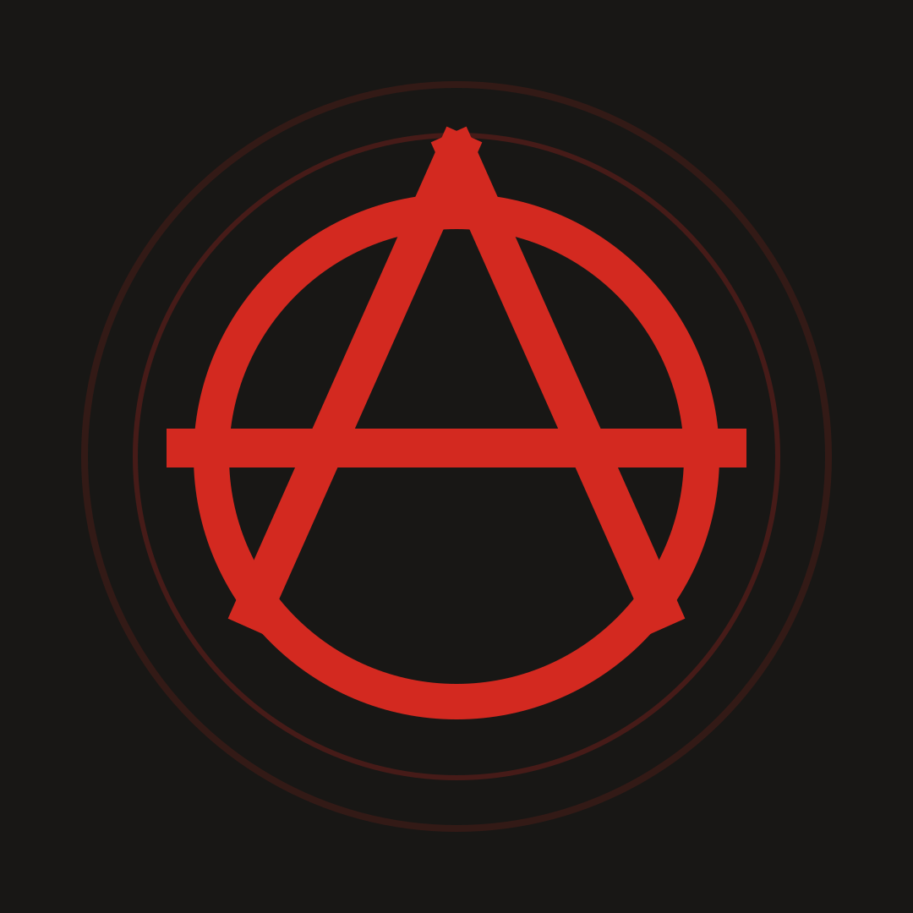

<p align="center">
  
</p>

<h1 align="center">JEUNESSE LIBERTAIRE</h1>

<p align="center">
  <strong>Participatory media for collective emancipation, popular education, and high school and university student struggles.</strong>
</p>

<p align="center">
  <a href="README.md">Esperanto</a> •
  <a href="README.fr.md">Français</a> •
  <a href="README.en.md"><b>English</b></a> •
  <a href="README.es.md">Español</a>
</p>

<p align="center">
  <a href="https://github.com/AnARCHIS12/jeunesse-libertaire"></a>
  <a href="https://www.spip.net"></a>
  <a href="https://www.php.net"></a>
  <a href="https://mariadb.org"></a>
  <a href="https://contrib.spip.net/NoSPAM"></a>
  <a href="LICENSE"></a>
  <a href="https://creativecommons.org/licenses/by-sa/4.0/"></a>
</p>

---

## Overview

**Jeunesse Libertaire** is an autonomous multimedia platform built by and for youth in struggle. Powered by the free and open CMS SPIP 4.4 within a hardened, containerized environment, it combines a public submission form for articles, an open Agora and direct debate area for companions, a collective review workflow without mandatory account creation, and robust anti-spam defense without external services or commercial tracking.

- **Total Autonomy & Zero CDNs**: zero requests to proprietary third-party servers (Google, Cloudflare, etc.). All scripts, stylesheets, and vector assets are self-hosted and functional offline or in isolated networks.
- **Sobriety & Raw Aesthetic**: elegant typography inspired by the avant-garde libertarian press (deep black `#0f0f10`, warm paper `#f4efe8`, impact red `#d32920`).
- **Collective Emancipation**: horizontal tools guaranteeing anonymity, freedom of publication, and the elimination of bureaucratic gatekeeping.

---

## Key Features

| Module | Description | Security & Ethics |
| :--- | :--- | :--- |
| **Direct Submission** | Submit texts, eyewitness reports, strike analyses, and general assembly minutes. | 4-second anti-bot validation, invisible honeypot, SHA-256 hashed IP rate limiter. |
| **Secret Tracking** | Private tracking link provided to the author to discuss with reviewers. | No account required, key fingerprint hashed in DB, excluded from search engines. |
| **Agora & Open Forum** | Continuous and horizontal debate space linked to the *Débats* section. | Prior collective moderation, native interactive `<details>` fold, zero intermediaries. |
| **NoSpam Defense** | Official NoSpam v3.0.1 extension with time tokens and deceptive honeypots. | 100% local, no intrusive captchas or puzzles, accessible by design. |
| **Collective Review** | Private interface for collegial assessment by the collective. | Quorum of two unanimous approvals required before actual publication. |
| **Autonomous Imagery** | Locally generated and auto-synced editorial thumbnails (`IMG/arton*.png`). | No external proprietary cloud storage, optimized WebP/PNG assets. |

---

## Quickstart

### 1. One-line automated installation

```bash
curl -fsSL https://raw.githubusercontent.com/AnARCHIS12/jeunesse-libertaire/main/install.sh | bash
```

The script installs system dependencies, generates three secure cryptographic secrets, creates the `.env` configuration file, deploys the Docker stack, and initializes the database.

For non-interactive production deployments:

```bash
curl -fsSL https://raw.githubusercontent.com/AnARCHIS12/jeunesse-libertaire/main/install.sh | \
  JL_INSTALL_DIR=/opt/jeunesse-libertaire \
  JL_SITE_ADDRESS=https://jeunesse.example.org \
  JL_WEB_PORT=8088 bash
```

### 2. Manual deployment with Docker Compose

```bash
# Clone the repository
git clone https://github.com/AnARCHIS12/jeunesse-libertaire.git
cd jeunesse-libertaire

# Configure environment
cp .env.example .env
# Set database passwords and public URL in .env

# Start services
docker compose up -d --build

# Activate the NoSpam plugin
echo yes | docker exec -i jeunesse-libertaire spip plugins:activer nospam

# Clear SPIP cache
docker exec jeunesse-libertaire spip cache:vider
```

The public platform is accessible at the URL defined in `SPIP_SITE_ADDRESS` (defaults to `http://localhost:8088`), and the private back-office at `/ecrire/`.

---

## Technical Architecture

```
jeunesse-libertaire/
├── assets/                          • Graphic assets, Ⓐ logos, and media
│   ├── agora-miniature.png          • Official Agora and Free Tribune thumbnail
│   ├── bienvenue-miniature.png      • Media welcome illustration
│   ├── avatar-reseaux-noir.png      • Circular monochrome Ⓐ logo
│   └── avatar-reseaux-rouge.png     • Circular red & black Ⓐ logo
├── config/                          • SPIP core configuration files
├── plugins/
│   ├── jeunesse_collaboratif/       • Core module: submission, secret tracking, and review
│   │   ├── base/                    • Database schemas
│   │   ├── formulaires/             • Submission form controllers
│   │   └── prive/                   • Collective review back-office panels
│   └── nospam/                      • Official NoSpam v3.0.1 extension
├── squelettes/                      • Frontend templates (HTML5 / SPIP)
│   ├── css/jeunesse.css             • Single, self-hosted stylesheet
│   ├── sommaire.html                • Homepage with editorial feed and banners
│   ├── article.html                 • Full article view and comment section
│   ├── forum.html                   • Open Agora, interactive accordion, and free debates
│   ├── rubrique.html                • Category listings (News, Debates, etc.)
│   ├── proposer.html                • Public submission form
│   ├── suivi-proposition.html       • Private discussion area between author and collective
│   └── mes_fonctions.php            • Custom SPIP filters and fallback thumbnail engine
├── docker-compose.yml               • Container orchestration (SPIP Web + MariaDB)
├── Dockerfile                       • Hardened SPIP container image
└── install.sh                       • Standalone installation script
```

---

## Contribution & Review Workflow

```
[Visitor] ──› Text submission (/spip.php?page=proposer)
                     │
                     ├──› Secret tracking key generated
                     └──› Article saved with status "prop" (Review)
                                    │
                                    ▼
                     [Collective Review Committee]
                     (Édition → Relecture collective)
                                    │
                     ├── Horizontal discussion with author
                     ├── Collective vote (Approval / Amendments / Opposition)
                     │
                     ▼
              [Quorum reached: 2 explicit approvals]
                     │
                     ▼
               Publication on the platform
```

1. **Submission**: the contributor enters a pseudonym and text, agrees to the CC BY-SA 4.0 copyleft license, and receives a secret tracking link.
2. **Collective Review**: companions in the collective inspect the draft inside the dedicated back-office area.
3. **Horizontal Dialogue**: the secret link allows the author to converse with reviewers without requiring a server account.
4. **Publication**: the article is published only when the collective quorum is fulfilled, preventing unilateral editorial decisions.

---

## Security & Defense in Depth

- **Active NoSpam v3.0.1**: heuristic spambot detection, dynamic honeypot traps, and time-signed tokens.
- **Zero Data Leakage**: email addresses are strictly optional and never exposed publicly.
- **Isolated Internal Network**: MariaDB is strictly bound to the internal `back` virtual network and inaccessible from outside.
- **Host Port Binding**: explicitly mapped to `127.0.0.1` by default to mandate a secure reverse proxy (Cosmos, Caddy, Nginx).
- **Secret Protection**: `.env` and sensitive cryptographic tokens are strictly excluded in `.gitignore`.

---

## Server Updates

To pull the latest updates onto your production server:

```bash
cd /path/to/jeunesse-libertaire
git pull origin main
docker compose up -d
echo yes | docker exec -i jeunesse-libertaire spip plugins:activer nospam
docker exec jeunesse-libertaire spip cache:vider
```

---

## Licenses

- **Source code, templates, and infrastructure**: [GNU General Public License v3.0 or later (GPL-3.0-or-later)](LICENSE).
- **Text content and articles**: [Creative Commons Attribution-ShareAlike 4.0 International (CC BY-SA 4.0)](https://creativecommons.org/licenses/by-sa/4.0/).
- **Photos and documents**: subject to the specific licenses indicated on each individual asset.
